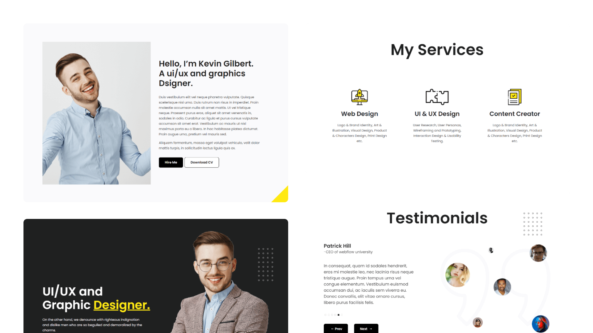

# Minimal - Personal Portfolio HTML Template

Minimal Personal Portfolio is a perfect choice for UI/UX designers, freelancers, creatives, and professionals seeking to establish a strong online presence and leave a lasting impact on their audience. 

## [Vvveb CMS](https://www.vvveb.com) theme.

👉🏻 [Theme page](https://themes.vvveb.com/product/minimal-personal-portfolio) 
👉🏻 [Theme development documentation](http://dev.vvveb.com/theme-introduction)


Check the [Live Demo here](https://minimal-personal-portfolio.netlify.app/).



## Build

### Generate html files

```bash
npm run gulp
```

### Watch for changes for development

```bash
npm run gulp watch
```

### Generate sections list for VvvebJs page builder

```bash
npm run gulp sections
```

### Generate screenshots for sections

```bash
npm run gulp screenshots
```


## Quick start

- Clone the repo and run it.
```bash
git clone https://github.com/Vvveb/minimal-personal-portfolio/edit/
cd minimal-personal-portfolio
npm i
npm run gulp
```


## Pages List
- One Page Website (Landing Page)


## Framework & Technologies
- Bootstrap 5
- Scss
- Swiperjs
- jQuery

## Credits
- Design & Developed by [Templatecookie](https://templatecookie.com)

## License
The MIT License (MIT). Please see [License File](LICENSE.md) for more information.

